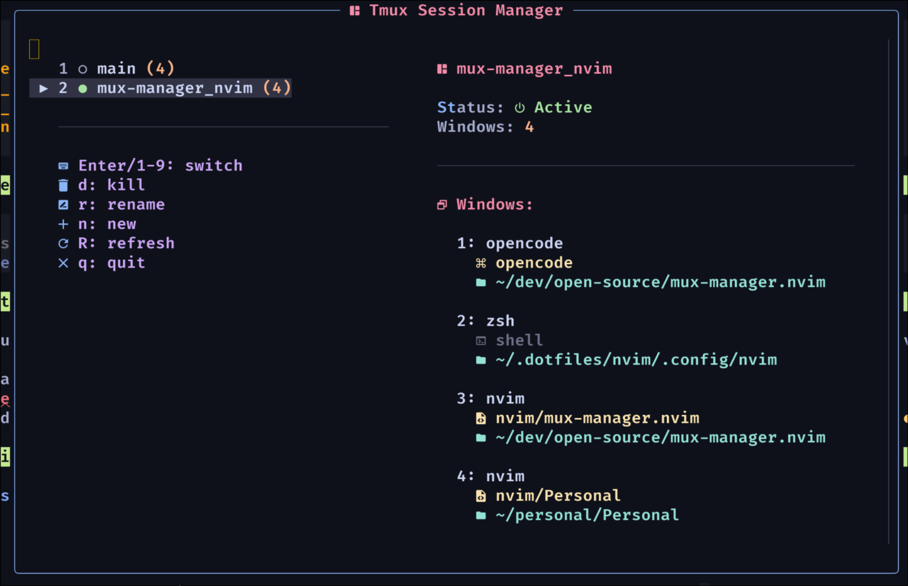

# telescope-mux-manager.nvim

A beautiful and functional tmux session manager for Neovim using Telescope.



## Features

- 🔍 **Telescope Integration** - Browse tmux sessions with fuzzy search
- 👁️ **Live Preview** - See actual terminal content of sessions before switching
- 🎯 **Project Sessionizer** - Create sessions from project directories
- ⚡ **Fast Switching** - Quick session management with keyboard shortcuts
- 🎨 **Beautiful UI** - Clean interface with status indicators
- 🤝 **Perfect Companion** - Pairs beautifully with [mux-sesh](https://github.com/quiet-ghost/mux-sesh) TUI for a complete tmux workflow

## Installation

### lazy.nvim

```lua
{
  "quiet-ghost/mux-manager.nvim",
  dependencies = { "nvim-telescope/telescope.nvim" },
  config = function()
    require("mux-manager").setup({
      directories = { "~/dev", "~/personal", "~/projects" }, -- Your project directories
      max_depth = 3, -- How deep to search in directories
      min_depth = 1, -- Minimum depth to search
      clone_directory = "~/code/repos", -- Where to clone GitHub repos
    })
    require("telescope").load_extension("mux_manager")
  end,
}
```

## Configuration

The plugin can be configured with the following options:

```lua
require("mux-manager").setup({
  directories = { "~/dev", "~/personal" }, -- Directories to search for projects
  max_depth = 3, -- Maximum depth to search in directories
  min_depth = 1, -- Minimum depth to search in directories
  clone_directory = "~/dev/repos", -- Where to clone GitHub repos
})
```

### Default Configuration

```lua
{
  directories = { "~/dev", "~/personal" },
  max_depth = 3,
  min_depth = 1,
  clone_directory = "~/dev/repos",
}
```

## Usage

```lua
-- Session manager
vim.keymap.set("n", "<leader>mm", "<cmd>Telescope mux_manager sessions<CR>")
```

## Related Tools

This plugin works perfectly with [mux-sesh](https://github.com/quiet-ghost/mux-sesh), a beautiful TUI tmux session manager. Together they provide:

- **mux-manager.nvim** - Session management from within Neovim
- **mux-sesh** - Standalone TUI for terminal-based session management
- **Shared workflow** - Both tools support GitHub repo cloning and configurable project directories

## Keybindings

### Session Manager

- `Enter` - Switch to session
- `<C-d>` - Kill session (with confirmation)
- `<C-r>` - Rename session
- `<C-n>` - Create new session

### Project Sessionizer

- `Enter` - Create/switch to session from directory

## Requirements

- Neovim >= 0.7
- tmux
- telescope.nvim

## Development

This plugin is currently in development. The working version is being refined and enhanced.
